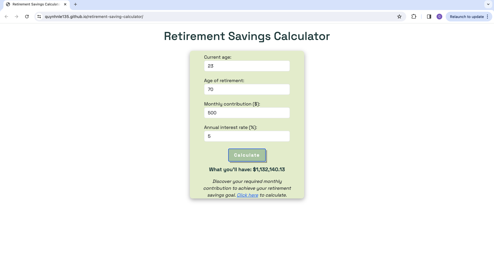
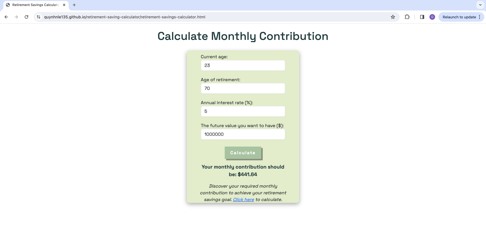

# Retirement Saving Calculator

- Simple web application to calculate your savings when you retire. You can also calculate how much you need to contribute monthly to have expected retirement savings.
- Built with HTML, CSS, Bootstrap5, and JavaScript

# Screenshots of Application

